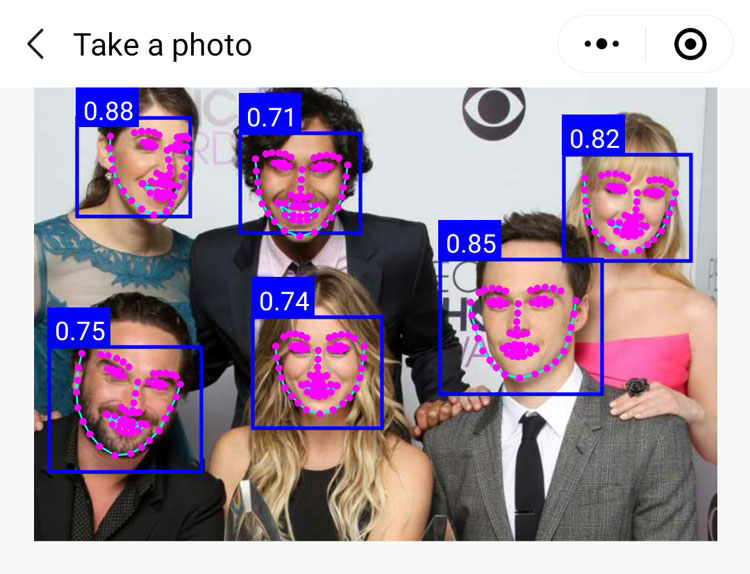

[Chinese README](https://zhuanlan.zhihu.com/p/81636351)  

## Updated

| Date　　　| Update |
| -- | -- |
| 2019-09-07 | New: A Face detecting and recognition with "face-api.js". |

## Introduction of WeChat MiniProgram AR with TFJS

TensorFlow.js is a library for machine learning in JavaScript. There is a WeChat Mini-program plugin for TensorFlow.js.

[tfjs-wechat](https://github.com/tensorflow/tfjs-wechat)

We can create AR effects with TensorFlow.js. A "face-api.js" library is base on TensorFlow.js.

The "face-api.js" brings face detection and face recognition in the browser environment. 

[face-api.js](https://github.com/justadudewhohacks/face-api.js)

Why choose "face-api.js"?

Because I do not find a tiny model of TensorFlow.js for face detectiong until I found the "face-api.js".

This demo demonstrates a face detecting and recognition using "face-api.js" library. 

Index Page


## Face Detecting

Use the demo to scan people's face.


Expect the effect below.

Use "Take a Photo" mode.



Use "Access a Camera" mode.


## Face Recognition

Two persons recognited are below.


Use the demo to scan people's face.

Expect the effect below.

Use "Take a Photo" mode.


Use "Access a Camera" mode.


## How to build

The WeChat Mini-program plugin depends on "abab" and "fetch-wechat" npm packages. 

step 1: npm install

step 2: run "微信开发者工具--工具--构建npm", a folder "miniprogram_npm" will be updated.

The project has included a folder "miniprogram_npm" precompiled.

File: /package.json

```javascript
  "dependencies": {
    "abab": "^2.0.0",
    "fetch-wechat": "0.0.3"
  }
```

## What changes to face-api.js

You can search a keyword "2019.8.22 modified" in face-api.js. The search result is a code modified.

For example, added a export of function "setEnv". Use the function "setEnv" to set a environment of Tensorflow.js on Wechat.

File: /utils/face-api.js

```javascript
    // 2019.8.22 modified
    exports.setEnv = setEnv;
```
## Set your website url of models

The project includes 3 models that are depolyed on a website. The default value of parameter "modelUrl" is a website url that may be very slow in your network. You can replace the default url with a web site url.

Download models: https://github.com/sanyuered/sanyuered.github.io/tree/master/models

```javascript
    // your website url
    const modelUrl = 'https://sanyuered.github.io/models/';
    // const modelUrl = 'http://127.0.0.1/models/';
```
## Known Issues

When using face detecting with face landmarks, a memory leak will occur on Android Wechat. The Mini-program will be slower and slower on a few minutes, but iOS Wechat has no the issue.
When using "Access a Camera" mode, the default value of parameter "isWithFaceLandmarks" is "false".


